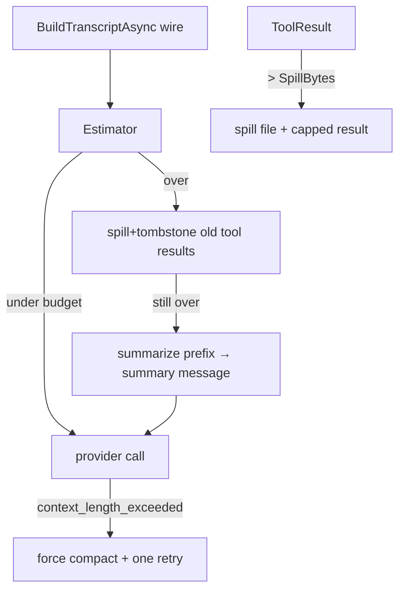

# SPEC-20261005-chat-context-management: Compaction, tool-output spill & token pressure

## 0. SPEC Metadata

| Field | Value |
|---|---|
| Feature name | Context compaction + spill store + token pressure meter |
| Product / System | agent-harness (Harness) |
| Module / Bounded Context | Application + Integrations + Domain + Server + Blazor WASM |
| Change type | Feature / Architecture |
| Repository | afonsoft/agent-harness |
| Technical owner | afonsoft |
| Suggested branch | `feat/devin-20261007-chat-context-mgmt` |
| Status | `Implemented` — entregue na branch `feat/devin-20261006-chat-context-management` |
| Depends on | SPEC-20261005-chat-background-resume (detached runs; wire transcript builder) |
| Reference | COMPARISON-20261005-deepseek-harness §1/#5–#6; `dsh-compaction-basic`, `dsh-spill`, `dsh-token-meter` |

## 1. Executive Summary

### Problem

`ChatService.BuildTranscriptAsync` appends **every** `ChatMessage` row to the
provider wire on every run — unbounded growth:

1. Long conversations eventually exceed the model's context window; the
   request fails with a provider error and the run dies — no recovery path.
2. Tool results (`shell_exec` output, `read_file`, `run_tests`) inline
   whole in history; one verbose build log permanently bloats every
   subsequent request and spends tokens forever.
3. The user has no visibility into context pressure or per-turn cost beyond
   the finops totals.

deepseek-harness addresses all three: `dsh-compaction-basic` runs a
`agent/pre-step` pressure check → prunes old tool results → summarizes older
surface into a `compaction/*` event (durable, replayable, resume-safe — the
current surface is derived, history stays in the log); `dsh-spill` caps tool
results and writes the overflow to a spill store the model can read back on
demand; `dsh-token-meter` publishes per-node token pressure.

### Solution

Three cooperating pieces:

1. **`ChatCompactionService`** — inside the run loop, before each provider
   call, estimate request pressure (heuristic tokenizer: `len/4` per text
   byte + image fixed cost; last provider `usage` when present as the
   anchor). When pressure ≥ `Taskboard:Chat:Context:CompactAtTokens`
   (default 80% of the resolved provider `MaxContextTokens`,
   `Chat:Context:MaxTokens` override):
   a. **Prune** tool-result messages older than the last N user messages
      (`Chat:Context:KeepRecentTurns`, default 6): content is replaced by a
      tombstone pointer (`[output compacted — id={spillId}]`) **after being
      spilled** (below) — history rows are untouched (the wire tombstone is a
      projection, not an update).
   b. If still over budget, **summarize**: a provider call with a fixed
      summarizer prompt over the prunable prefix → the wire's first user
      section is replaced by `
…
` + the kept suffix.
      Record a `ChatCompaction` row (`RunId`, `TokensBefore/After`,
      `SummaryMessageId`) for audit and to persist the summary so *next*
      runs reuse it instead of re-summarizing.
   c. On provider error `context_length_exceeded` mid-run: retry once after
      a forced compaction (their `agent/request-error` equivalent).
2. **`ChatSpillStore`** — any tool result > `Chat:Context:SpillBytes`
   (default 8 KB) is written to `~/.agent-harness/spill/{runId}/{seq}.txt`;
   the tool result the model sees is capped at `SpillHeadBytes` (2 KB) with
   `[truncated — N bytes total; read_file spill://{id} offset/len]`. A
   `read_file`-compatible scheme lets `read_file`/`shell_exec cat`-style
   reads fetch ranges (`spill://` resolves via the store, so no new tool is
   needed). Spill files are per-run, cleaned by the `chat-run-retention`
   job.
3. **Pressure meter** — run responses/SSE `chat.pressure`
   `{estimatedTokens, limitTokens, compacted}` emitted at run start and
   after each compaction; `ProviderChat` header shows a thin meter
   (green→amber→red) with tooltip (est. tokens / limit). `ChatRun` gains
   `ContextTokensLimit` + `CompactionCount` for finops.

### Scope

In scope: estimation + compaction loop + summary reuse, spill store +
`spill://` read scheme + cap/truncation, pressure event + header meter,
retention integration, config keys, tests.

Out of scope: semantic/pinned messages ("never compact this"), per-node
pricing, token-accurate provider tokenizers (heuristic + usage anchor only),
compact-on-demand slash command (`/compact` is a P2 note), cross-run
compaction scheduling.

## 2. Requisitos

### Funcionais

- RF-001 `TokenPressureEstimator`: tokens per message = `ceil(contentBytes/4)`
  + fixed per-tool-call overhead (16) + image occurrences (1000) — heuristic
  only; replaced by last `usage.PromptTokens` when the provider reported one
  for the same wire head (anchor + delta growth, their "baseline" pattern).
- RF-002 Pressure check runs **before each provider call** in `RunAsync`
  (not just run start): `pressure >= CompactAtTokens` triggers the
  prune-then-summarize pipeline.
- RF-003 Prune: tool-result wire entries older than the last
  `KeepRecentTurns` user messages spill (if > `SpillBytes`) and are replaced
  by tombstone text — wire-only; `ChatMessage` rows never mutate.
- RF-004 Summarize: one non-tool provider call
  (`role=system` summarizer prompt, `Chat:Context:SummaryPrompt` config,
  max_tokens `Chat:Context:SummaryMaxTokens` default 1200) produces a
  summary persisted as `ChatMessage` (`Role=system`, `Kind=summary`,
  `SupersedesUntilMessageId`) — wire builder already skips messages ≤ that
  bound on later runs (reuse across runs; no re-summarize).
- RF-005 `context_length_exceeded` (or provider equivalent) mid-run → force
  compaction + retry the same step once; a second failure surfaces as
  `ChatDoneEvent(error=…)` as today.
- RF-006 Spill: result > `SpillBytes` → file + capped head + pointer line;
  `spill://{id}` readable via `read_file` with `offset`/`limit` args; spill
  ids are `{runId}-{seq}` deterministic.
- RF-007 `chat.pressure` SSE event after each estimation +
  `ChatRun.ContextTokensLimit`/`CompactionCount` persisted; ProviderChat
  meter.
- RF-008 `chat-run-retention` deletes `spill/{runId}/` dirs with expired
  runs; orphan sweep on boot.
- RF-009 Config catalog: `Taskboard:Chat:Context:{CompactAtTokens,
  MaxTokens, KeepRecentTurns, SpillBytes, SpillHeadBytes, SummaryMaxTokens,
  SummaryPrompt}` (+ `Enabled` master switch default true).

### Não-funcionais

- RNF-001 Compaction is **wire-projection only**: `ChatMessage` history
  stays complete for the UI and for re-derivation; resume/attach after
  compaction replays real history, wire rebuild applies the same projection.
- RNF-002 Summarization failures never kill the run: fall back to prune-only
  and continue.
- RNF-003 Spill dir lives under `~/.agent-harness/spill/` (home, not repo);
  symlink/traversal-safe ids only.
- RNF-004 Estimation cost O(messages) per step is acceptable (heuristic,
  no tokenizer lib).

## 3. Arquitetura

- `ChatCompactionService` injected into `ChatService`; keeps the wire
  mutable per run (`wire` is already a `List<OpenAiChatMessage>` — apply
  tombstones/summary in place).
- `ChatSpillStore` in `Taskboard.Integrations` next to `ChatImageStore`;
  tools get `ISpillStore` for `spill://` resolution inside `FileSystemTools`.
- `Kind`/`SupersedesUntilMessageId` columns on `ChatMessage` (migration) —
  `BuildTranscriptAsync` skips superseded rows when a summary exists.
- Meter: `chat.pressure` on run SSE + `run.pressure` on `ChatRunHub` for
  sidebar badge.

## 4. Fases

- **P1** — estimator + pressure check + prune/spill + `spill://` + meter
  events/UI.
- **P2** — summarization + `summary` rows + reuse across runs + overflow
  retry + `/compact` manual trigger.

## 5. Testes

- Unit: estimator heuristic bounds; prune respects `KeepRecentTurns`;
  spill cap writes file + head+pointer; `spill://` range reads; summary
  reuse skips superseded rows; overflow retry once.
- Integration: synthetic big history → run completes with `CompactionCount≥1`
  and meter event; spill file created + model-visible pointer; retention
  removes dir.
- Blazor guard: meter renders states; no summary note leaking as user text
  (renders as system pill).

## 6. Open questions

1. Default `CompactAtTokens` — 80% of provider context or fixed 96k?
   Proposed: provider-`MaxContextTokens` × `CompactRatio` (0.8) with
   `MaxTokens` absolute override.
2. Should compaction notify the model it happened (a user-role note)?
   Proposed: yes — one-line `"[context compacted — older tool outputs were
   summarized]"` appended after compaction, mirroring theirs.
