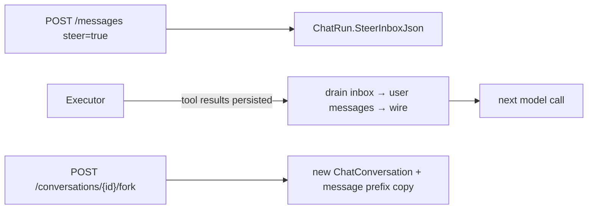

# SPEC-20261005-chat-fork-steering: Conversation fork & mid-turn steering

## 0. SPEC Metadata

| Field | Value |
|---|---|
| Feature name | Fork conversation at message + mid-turn steering |
| Product / System | agent-harness (Harness) |
| Module / Bounded Context | Domain + Application(.Contracts) + EntityFrameworkCore + Server + Blazor WASM |
| Change type | Feature |
| Repository | afonsoft/agent-harness |
| Technical owner | afonsoft |
| Suggested branch | `feat/devin-20261007-chat-fork-steering` |
| Status | `Implemented` — entregue na branch `feat/devin-20261006-chat-fork-steering` |
| Depends on | SPEC-20261005-chat-background-resume (`ChatRun` queue + attach) |
| Reference | COMPARISON-20261005-deepseek-harness §1/#3–#4; `ctx.sessions.create(seed)` fork, `agent.steer()` |

## 1. Executive Summary

### Problem

Two transcript-level capabilities are missing:

1. **No fork**: to try a different direction the user must either keep
   polluting the same conversation ("actually, do X instead") or copy
   context into a new chat by hand. deepseek-harness forks a session by
   replaying a prefix into a new session with `inheritedEventCount` lineage —
   cheap "branch the conversation at this message".
2. **No steering**: a message sent while a run is executing is enqueued as
   the *next run* (SPEC-20261005 P1 FIFO). deepseek-harness's `agent.steer()`
   injects the message at the **next step boundary of the open turn** — the
   model sees the correction inside the same turn ("stop, that's the wrong
   file") instead of finishing the wrong work and starting a new turn.

### Solution

**Fork**: `POST /api/local/chat/conversations/{id}/fork {messageId}` creates
a new `ChatConversation` with `ForkedFromConversationId` +
`ForkedAtMessageId` lineage and copies the prefix (all messages up to and
including `messageId`, preserving order and content; tool/system rows kept).
The new conversation appears in the sidebar as `"{title} (fork)"` — title
editable; the source conversation is untouched. Queue state does not copy:
the fork starts idle even if the source was running.

**Steering**: extend the send path with a `steer` flag
(`POST /messages {content, steer:true}`). When a run is in-flight for the
conversation, the message is written to a per-run **steer inbox**
(`ChatRun.SteerInboxJson` — durable so it survives attach/dispatch) and the
executor consumes it at the next tool-result boundary: after the current
batch of tool results is persisted, the steer content is persisted as a user
message and appended to the live wire transcript before the next model call
— same turn, new context. If no run is active it degrades to a normal
queued send. UI: composer gets a "Send" vs "Steer" affordance
(Ctrl+Enter = steer when running) + a queued/steered message chip in the
transcript showing pending steer items; a steer chip can be withdrawn
before it is claimed (cancel → deletes the pending steer row/entry).

### Scope

In scope: fork endpoint + lineage columns + copy service + sidebar badge,
steer inbox + loop consumption + composer affordance + pending-chip +
cancel, events, tests.

Out of scope: branch-tree visualization (forks show a badge + "origin"
link only), fork-of-fork depth limits (unbounded, lineage is a chain),
steering into *queued* (not yet executing) runs, editing a claimed steer,
multi-select copy.

## 2. Requisitos

### Funcionais

- RF-001 `ChatConversation.ForkedFromConversationId` +
  `ForkedAtMessageId` (nullable, migration). Fork copies messages with `Id`
  regeneration; `ChatMessage.ForkedFromMessageId` back-pointer for
  dedup/trace.
- RF-002 `POST /conversations/{id}/fork` validates `messageId` belongs to
  the conversation (400 otherwise), creates the fork, copies the prefix in
  one transaction, returns the new conversation DTO.
- RF-003 Fork excludes: runs (new conversation starts with no `ChatRun`s),
  approvals, push/notify state, `PlanMode` copies the value at fork time.
- RF-004 Sidebar: fork shows "↯ fork of {source title}" subtitle linking to
  the source; source shows a fork-count badge.
- RF-005 Steer: `POST /messages {steer:true}` during an active run appends
  to `SteerInboxJson` (`[{id, content, createdAt}]`, cap 10 — 409 beyond)
  and broadcasts `steer.queued`; when no run is active it behaves like a
  normal send (no-op flag).
- RF-006 Executor drains the steer inbox at each tool-result boundary
  (before the next provider call): persist each as `ChatMessage(role=user,
  source=steer)`, append to wire, emit `steer.claimed`. Mid-response
  (non-tool) steps are not interrupted.
- RF-007 `POST /conversations/{id}/steer/{steerId}/cancel` removes an
  unclaimed steer (409 once claimed); UI pending chip has ✕.
- RF-008 Steer-claimed messages render with a `steer` marker in the
  transcript (icon + tooltip) so the history shows it entered mid-turn.

### Não-funcionais

- RNF-001 Fork copy is one transaction; a 10k-message conversation forks in
  <2s on SQLite (batched insert).
- RNF-002 Steer drain is serialized with the run (no concurrent claims);
  steers are durable — dispatcher crash + attach replays pending steers.
- RNF-003 No behavioral change when `steer` is absent/false (pure opt-in).

## 3. Arquitetura

- **Domain**: `ChatConversation.ForkedFrom*` columns;
  `ChatMessage.ForkedFromMessageId`; `ChatRun.SteerInboxJson` (json column,
  or separate `ChatRunSteer` rows if querying pending steers matters —
  choose rows for `cancel` indexing).
- **Application**: `ChatService.ForkAsync`; steer drain inside the existing
  tool-loop iteration in `RunAsync` (after persisting tool results, before
  next provider call).
- **Server**: fork + steer-cancel endpoints; `steer.*` SSE events on the
  run stream.
- **Client**: composer Steer modifier + pending chips; fork action on each
  message row (⎇ icon) and on the conversation menu ("Fork from here");
  sidebar fork badge.

## 4. Fases

- **P1** — fork (endpoint, copy, lineage, sidebar badge, message-row
  action).
- **P2** — steer inbox + drain + composer affordance + cancel + markers.

## 5. Testes

- Unit: `ForkAsync` copies prefix exactly (order, content, ids
  regenerated), rejects foreign messageId, excludes runs/approvals; steer
  drain order and claim-at-boundary semantics; cap 10.
- Integration: fork mid-conversation → new conversation has prefix + badge;
  send steer during tool-call run → transcript shows steer user-message
  before the next assistant message; cancel unclaimed steer.
- Blazor guard: fork action posts and navigates; steer chip withdraw.

## 6. Open questions

1. Fork default — include or exclude the trigger message? Proposed: include
   up to and including `messageId` (matches "continue from here").
2. Should steering a finished-but-queued conversation auto-start the next
   run? Proposed: yes — it degrades to normal send which enqueues.
3. Fork archived conversations allowed? Proposed: yes; the fork is created
   active (not archived).
