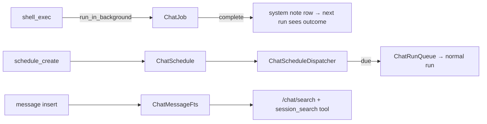

# SPEC-20261005-chat-jobs-schedule-search: Background jobs, scheduled follow-ups & full-text search

## 0. SPEC Metadata

| Field | Value |
|---|---|
| Feature name | Model-facing background jobs + scheduled follow-ups + FTS over conversations |
| Product / System | agent-harness (Harness) |
| Module / Bounded Context | Application(.Contracts) + Integrations + Domain + Server + Blazor WASM |
| Change type | Feature |
| Repository | afonsoft/agent-harness |
| Technical owner | afonsoft |
| Suggested branch | `feat/devin-20261009-chat-jobs-schedule-search` |
| Depends on | SPEC-20261005-chat-background-resume (dispatcher); ManagedJob infra |
| Reference | COMPARISON-20261005-deepseek-harness §1/#7–#9 (`run_in_background` + `job_*`, `schedule_*`, `session-query`) |

## 1. Executive Summary

### Problem

Three capability gaps vs deepseek-harness:

1. **Synchronous shell only** — `shell_exec` blocks the turn until the
   command exits; a build/watch/long command either times out or burns the
   turn. Their `bash` accepts `run_in_background` and `job_{list,output,kill}`
   manage the jobs with a live stream UI.
2. **No scheduled follow-ups** — their `schedule_{create,list,update,delete}`
   tools let the model set reminders/follow-ups that wake the *same session*
   (cron/at/afterSeconds). Ours can schedule managed jobs, but not
   conversation-bound self-prompts ("relembra eu checar o deploy em 30min").
3. **Title-only search** — the sidebar search is a `LIKE` on
   `ChatConversation.Title`; finding "a conversa onde discutimos o erro de
   OAuth" needs scrolling. Their `session-query` offers cross-corpus FTS +
   `session_search`/`session_event_search` model tools.

### Solution

1. **Background jobs**: `shell_exec` gains `run_in_background: bool` →
   registers a `ChatJob` (conversationId, runId, command, status, exitCode,
   pid) executed through the existing `ManagedJob`/`ShellExec` machinery;
   result returns `{jobId}` immediately. New tools `job_list` (conversation
   or run-scoped), `job_output {jobId, tailBytes}` (spill-capped), `job_kill
   {jobId}`. Job completion emits `chat.job` SSE + pushes a system note row
   so the next run sees the outcome. UI: live jobs strip under the composer
   (running jobs with elapsed/kill) + tool cards.
2. **Scheduled follow-ups**: `schedule_create {kind:cron|at|after_seconds,
   when|expr, prompt, title}` persists a `ChatSchedule` bound to the
   conversation; a `ChatScheduleDispatcherService` (same hosted-service
   pattern as `ChatRunDispatcherService`) enqueues a chat run with that
   prompt at due time — reusing `ChatRunQueue` so it respects the FIFO.
   `schedule_list/update/delete` tools + a "Agendados" popover in the chat
   header listing/cancelling them; delivery marks `LastDeliveredAt`. Missed
   fires (server down) deliver once at boot.
3. **Full-text search**: SQLite FTS5 virtual table `ChatMessageFts`
   (content, conversationId, messageId) maintained by trigger-style sync in
   `ChatService` (insert/update hooks) + backfill migration. Endpoint
   `GET /api/local/chat/search?q=&conversationId=&limit=` returning
   `{conversationId, conversationTitle, messageId, snippet, createdAt,
   rank}` ordered by bm25. Sidebar search becomes a mode toggle:
   "Títulos | Conteúdo"; content mode shows grouped results and
   clicking jumps to the conversation and scrolls the message. Model-facing
   `session_search {query}` tool (capability-gated, read-only) searching
   across the operator's conversations — same values deepseek's
   `session_search` gives their agent.

### Scope

In scope: `run_in_background` + job tools + live strip; `ChatSchedule` +
dispatcher + tools + popover; FTS5 + endpoint + UI mode + `session_search`
tool; tests.

Out of scope: PTY/interactive background sessions, stdout streaming into
the transcript mid-run (job output is polled via `job_output`), cron
timezones beyond UTC+explicit IANA tz field, FTS ranking config UI,
searching legacy `AiChatThread`s.

## 2. Requisitos

### Funcionais

- RF-001 `shell_exec.run_in_background` → `ChatJob` row + immediate result
  `{jobId, status:"running"}`; completion persists exitCode/output tail and
  writes a `system` note message (`[job {id} finished: exit {code}]`) so the
  transcript carries the outcome.
- RF-002 Tools `job_list` (filter active|all, conversation-scoped default),
  `job_output` (tail-capped via spill), `job_kill` (SIGTERM→SIGKILL),
  capabilities `tool:job_*` default-on.
- RF-003 Live jobs strip in `ProviderChat` (poll or `chat.job` SSE): name,
  elapsed, kill button; persisted `ChatJob`s render for re-attached runs.
- RF-004 `ChatSchedule` (`cron|at|after_seconds` normalized to next UTC fire
  time, title ≤120, prompt, `active|inactive`, `LastDeliveredAt`) + hosted
  dispatcher (30s tick, jittered, single-fire delivery marks done for
  `at|after_seconds`; cron recomputes).
- RF-005 `schedule_create/list/update/delete` tools (delete requires the
  schedule id; `update` supports `cancel`); model tools are
  conversation-scoped; `Taskboard:Chat:Schedule:MaxPerConversation` (20).
- RF-006 Delivery enqueues a normal chat run (same `ChatRunQueue`, user
  message `source=schedule`) — respects FIFO, detached, notifications fire
  as usual. Missed fires deliver once at boot (`LastDeliveredAt` guard).
- RF-007 FTS5 `ChatMessageFts` (`content UNINDEXED?` no — `content`,
  `conversationId UNINDEXED`, `messageId UNINDEXED`); sync on message
  insert; migration backfills existing rows.
- RF-008 `GET /chat/search` bm25-ranked, snippet with `<mark>`s,
  conversation filter param, cap 50.
- RF-009 Sidebar "Conteúdo" search mode: grouped results, click opens the
  conversation and scrolls the hit into view (message anchor `#m-{id}`).
- RF-010 `session_search` model tool (read-only, cap 10 results, snippet ≤
  200 chars each) — agent can recall prior conversations.

### Não-funcionais

- RNF-001 Background jobs obey the same security gateway as `shell_exec`
  (workspace confinement, dangerous-command refusal).
- RNF-002 Schedule dispatcher is durable across restarts (rows, not
  in-memory timers); single-writer tick.
- RNF-003 FTS keeps index size bounded (no tool-output bodies over
  `SpillBytes`? — index full content but snip snippets; pragmatic: index
  all, accept size, document VACUUM).
- RNF-004 No behavior change without opt-in flags: `Chat:Jobs:Enabled`,
  `Chat:Schedule:Enabled`, `Chat:Search:Enabled` (all default true).

## 3. Arquitetura

- `ChatJob` reuses `ShellExecTool`'s process runner but owned by a new
  `ChatJobService` (server-hosted, process registry + reap on exit).
- `ChatScheduleDispatcherService` mirrors `ChatRunDispatcherService`
  (tick → due rows → `ChatService.EnqueueAsync` with `source=schedule`).
- FTS sync is synchronous-in-transaction on message save (SQLite FTS5
  `content=''` external-content table kept via manual `INSERT INTO fts`).

## 4. Fases

- **P1** — `run_in_background` + job tools + live strip + note rows.
- **P2** — schedules (entity, dispatcher, tools, popover, boot-missed
  delivery).
- **P3** — FTS (schema + sync + endpoint + UI mode + `session_search`).

## 5. Testes

- Unit: background job lifecycle incl. kill; schedule normalization &
  missed-fire; FTS sync on insert/delete; bm25 ranking sanity.
- Integration: background `sleep` + `job_output` + completion note row;
  `schedule_create after_seconds=1` → run fires within ~30s tick (test hook
  shortens tick); search hits message body, not titles.
- Blazor guard: jobs strip, popover list/cancel, content-mode results jump.

## 6. Open questions

1. `job_output` live-tail while running (stream into tool result chunks)?
   Proposed: poll only — streaming tool results are a larger change.
2. Should a scheduled run under an open run queue or steer? Proposed:
   queue (FIFO) — steer semantics belong to humans.
3. FTS tokenizer — `unicode61` default vs `trigram`? Proposed:
   `unicode61` (pt-BR-friendly, bm25-ready).
