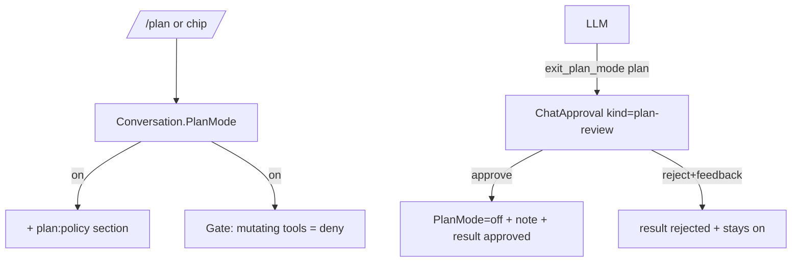

# SPEC-20261005-chat-plan-mode: Plan mode with plan review gate

## 0. SPEC Metadata

| Field | Value |
|---|---|
| Feature name | Plan mode — `/plan` + `exit_plan_mode` + review card |
| Product / System | agent-harness (Harness) |
| Module / Bounded Context | Application(.Contracts) + Integrations (tool) + Server + Blazor WASM |
| Change type | Feature |
| Repository | afonsoft/agent-harness |
| Technical owner | afonsoft |
| Suggested branch | `feat/devin-20261006-chat-plan-mode` |
| Status | `Approved` — aprovado por afonsoft (2026-10-05) |
| Depends on | SPEC-20261005-chat-tool-approval (enforcement gate, approval cards) |
| Reference | COMPARISON-20261005-deepseek-harness §1/#2; `dsh-plan-mode` (`plan:policy` section, `exit_plan_mode`, `/plan` command) |

## 1. Executive Summary

### Problem

Today every prompt goes straight to execution: for anything non-trivial the
model starts running mutating tools immediately. Users who want "think
first, show me a plan, then act" have no mode — they either deny tools one by
one or let it run.

deepseek-harness ships **plan mode**: a logged per-agent state; while active
a `plan:policy` system-prompt section steers the model to plan instead of
act, mutating tools stay denied, and the model exits by calling
`exit_plan_mode` with a complete markdown plan that the user reviews
(approve → act; feedback → revise). `/plan` toggles it; a selection made
mid-run is applied at the next step boundary, never silently lost.

### Solution

Port the capability, adapted to our approval seam:

1. **`ChatConversation.PlanMode`** (`off | on | pending-exit`) — per
   conversation; `/plan [off]` slash command and a header toggle chip.
2. **`plan:policy` prompt section** appended to `ChatService.SystemPrompt`
   while active: instructs the model to inspect/read-only and produce a plan
   instead of mutating.
3. **`exit_plan_mode` tool** (new `IChatTool`, capability-gated): argument
   `plan` (markdown, must start with `#`); validates, persists the plan on
   the run, emits `plan.review` SSE + hub event, and — reusing
   SPEC-…-chat-tool-approval's suspend/answer machinery — waits for the
   decision. Approve → exit plan mode (state `off`, `plan/mode` note row) +
   tool result `"approved"`; Reject with feedback → tool result
   `"Plan rejected: <feedback>"` and the model revises in plan mode.
4. **Read-only enforcement while planning**: the approval gate treats every
   mutating/`RequiresConfirmation` tool as `deny` (not `ask`) while plan
   mode is on — the model gets `"Plan mode is active: mutations are not
   allowed. Present a plan via exit_plan_mode."` — so execution tools stay
   in the catalog (catalog stability) but calls fail loud.
5. **Pending semantics**: toggled mid-run takes effect at the next tool-call
   boundary of the open run; a pending `exit_plan_mode` review survives
   browser close (replayable) and times out to `rejected`/`unavailable`
   (fail-closed — stays in plan mode).

### Scope

In scope: `PlanMode` on `ChatConversation` (migration), prompt section,
`exit_plan_mode` tool + review card + decide endpoint reuse, `/plan` slash
command + header chip, enforcement via approval gate, tests.

Out of scope: plan templates/library, multi-plan versioning beyond storing
each presented plan on its approval row, auto-entering plan mode per task
class, applying plan files to `.specs/` (manual copy).

## 2. Requisitos

### Funcionais

- RF-001 `ChatConversation.PlanMode` persisted (`"on" | "off"`); toggle via
  `POST /conversations/{id}/plan-mode {active}` — idempotent, allowed
  mid-run; `on→off` also cancels a pending review (marked `cancelled`).
- RF-002 While `on`: `SystemPrompt` gains the `plan:policy` section
  (static text: "Plan mode is active. Do not mutate. Inspect read-only and
  produce a plan; call `exit_plan_mode` when ready."); mutating tools are
  denied pre-execution with the loud refusal message.
- RF-003 `exit_plan_mode` tool registered always (capability `tool:exit_plan_mode`,
  enabled default, non-mutating): validates `plan` non-empty and starts with
  `#`; creates a `ChatApproval` of kind `plan-review` with `ArgumentsPreview
  = plan`; `approval.asked`-equivalent `plan.review` event; waits (timeout =
  approval timeout); approve→result `{approved:true}` + `PlanMode=off` +
  plan persisted on approval row; reject→result `{approved:false, feedback}`
  staying `on`.
- RF-004 Plan review UI: dedicated card (rendered markdown + Approve /
  Revise with feedback input) in ProviderChat; pending review is replayed on
  attach like approvals (list endpoint returns pending `plan-review` rows).
- RF-005 `/plan` and `/plan off` slash commands in `SlashCommandComposer`
  plus a header chip mirroring `PlanMode` with pending indicator.
- RF-006 Audit: mode changes write a `system` ChatMessage note
  (`plan mode on|off`) so history shows when the mode flipped.

### Não-funcionais

- RNF-001 Enforcement at the gate, not the prompt — a direct tool call must
  be refused regardless of what the model emits (prompt section is
  guidance; gate is law).
- RNF-002 No silent plan-mode loss: a review unanswered when the run ends
  (stop/timeout) leaves `PlanMode=on` and a `cancelled`/`unavailable`
  record; next send re-enters planning.
- RNF-003 Prompt-section text is config-owned
  (`Taskboard:Chat:PlanMode:Section`) so deployments can reword.

## 3. Arquitetura

- Reuse `ChatApproval` with `Kind` discriminator (`tool-call |
  plan-review`) — one table, one decide endpoint, one pending list.
- `ChatService` reads `conversation.PlanMode` per iteration (live) so a
  mid-run toggle applies at the next tool classification.
- Denial for mutating calls while planning is a synthetic tool result, not
  a hidden filter — the model sees why.

## 4. Fases

- **P1** — `PlanMode` + prompt section + gate deny + `exit_plan_mode` +
  review card + decide reuse + `/plan`.
- **P2** — header chip, Settings default (`Taskboard:Chat:PlanMode:Default`
  for new conversations), plan markdown export (copy/download button on the
  review card).

## 5. Testes

- Unit: gate deny while on; `exit_plan_mode` validation (empty, no `#`,
  oversize); approve path flips `PlanMode` + writes note; reject stays on.
- Integration: enable plan mode → send task → mutating call refused →
  `exit_plan_mode` review event → approve → next call executes; reject with
  feedback → model turn continues in plan mode.
- Blazor guard: review card renders markdown; pending review replay on
  attach.

## 6. Open questions

1. Auto-approve plans when preset=`full`? Proposed: no — plan review is a
   semantic gate, orthogonal to tool policy.
2. Should approving a plan auto-queue the "execute it" run, or wait for the
   user to send? Proposed: `exit_plan_mode` result tells the model to
   proceed — the same open run continues (matches theirs).
