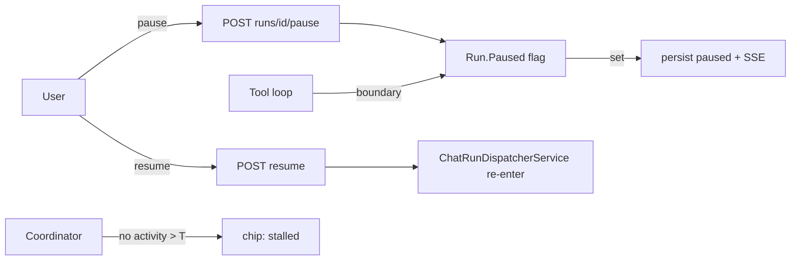

# SPEC-20261012-chat-run-controls: Pause/resume, agent state chip, stuck watchdog

## 0. SPEC Metadata

| Field | Value |
|---|---|
| Feature name | Chat run controls — pause/resume + visible agent state + stall detection |
| Product / System | agent-harness (Harness) |
| Module / Bounded Context | Domain (ChatRunStatus) + Application (dispatcher) + Server + Blazor |
| Change type | Feature |
| Repository | afonsoft/agent-harness |
| Technical owner | afonsoft |
| Suggested branch | `feat/devin-20261012-chat-run-controls` |
| Status | `Draft` |
| Depends on | SPEC-20261005-chat-background-resume |
| Reference | OpenHands `AgentState` (running/paused/stopped/finished/error/stuck/waiting_confirmation); Devin sleep/wake; `runs/{id}/pause|resume` (orchestration, Program.cs:1537) |

## 1. Executive Summary

### Problem

A chat run can only be stopped (cancelled) or watched — no pause. The header
shows a boolean spinner, not an agent state machine, so `waiting approval`,
`queued` and `stalled` are indistinguishable. OpenHands exposes the full
`AgentState` and pause; Devin wakes/sleeps sessions on demand.

### Solution

1. **`ChatRunStatus` += `paused`** (terminal-safe new enum value;
   `IsActive` covers it).
2. **Pause/resume endpoints** on the conversation run:
   `POST /api/chat/conversations/{id}/runs/{runId}/pause` → cooperative —
   the dispatcher honors a pause flag at the next tool-call boundary or
   stream chunk flush (never mid-tool); run row gets `paused` + SSE
   `chat.paused`. `resume` re-queues execution (same run row, status
   `running`, SSE `chat.resumed`) — it does **not** enqueue a new run.
3. **State chip** in the chat header: `queued | running | paused |
   waiting-approval | stalled` derived from run + pending approvals +
   activity timestamp; terminal states shown on the last run.
4. **Stall watchdog**: a run `running` with no event/partial flush for
   `Chat:StallThresholdSeconds` (default 120, runtime-configurable) surfaces
   `stalled` on the chip + a nudge affordance (Continue waiting / Stop run).
   No new status — derived, like `waiting-approval` already is.

### Scope

In scope: statuses/endpoints/UI above + tests. Out of scope: pausing
delegated child runs (their own pipeline), sleeping the whole app, OS-level
suspend.

## 2. Requisitos

### Funcionais

- RF-001 `ChatRunStatus.Paused` accepted by `AllowedValues`; `IsActive`
  = queued|running|paused; migrations none (string column).
- RF-002 Pause sets `PausedAt` + status `paused`; persists `PartialContent`
  checkpoint; SSE/hub emits `chat.paused` so open clients update chip and
  keep partial text visible.
- RF-003 Pause while `queued` removes from the FIFO front (status `paused`,
  stays resumable); pause while `waiting-approval` suspends *without*
  cancelling pending `ChatApproval`s (they stay pending; deciding them on a
  paused run is allowed but no tool executes until resume).
- RF-004 `resume` on `paused` → `running`, dispatcher re-enters the tool
  loop at the checkpoint; `chat.resumed` emitted; idempotent 204 on
  already-running; 409 on terminal.
- RF-005 `stop` on a paused run → `stopped` (terminal) — pending approvals
  cancelled as today.
- RF-006 Header chip component `AgentStateChip.razor`: icon + label per
  state (queued `Hourglass`, running `PlayFill`, paused `PauseFill`,
  waiting-approval `HandIndex`, stalled `ExclamationTriangle`, failed
  `XCircle`, completed `CheckCircle`); click → focuses the pending approval
  card / last tool card.
- RF-007 `stalled` derivation: `Running && LastActivityUtc <
  now-threshold`; `LastActivityUtc` updated on every partial flush and tool
  event (cheap in-memory stamp on the coordinator; not persisted).
- RF-008 Pause/resume buttons in the composer area next to Stop; keyboard
  `Ctrl+.` pause toggle while a run is active.

### Não-funcionais

- Pause must be observable within one tool-call boundary; never hard-kill
  a tool mid-execution.
- Resume survives server restart: `paused` rows rehydrate as resumable
  (interrupted-run sweep leaves `paused` untouched).
- SSE replay: attaching to a paused run replays buffered content + emits
  `chat.paused`.

## 3. Arquitetura

- `ChatRunCoordinator` holds the pause request map (in-memory flag +
  persisted status; double-checked at boundaries so restart state is the DB).
- `ChatService` gains `PauseRunAsync/ResumeRunAsync`; dispatcher consults the
  flag where it already checkpoints partial content.
- Chip derivation stays client-side off the SSE stream + pending-approval
  list (no new polling).

## 4. Fases

- **P1** — `paused` status + pause/resume endpoints + loop boundary +
  SSE events + header chip.
- **P2** — stall watchdog + stalled badge + Stop affordance + Ctrl+..

## 5. Testes

- Unit: status transitions (queued→paused→running→paused→stopped;
  terminal→409); pause during pending approval; resume idempotent.
- Integration: enqueue → pause before start (stays paused, dispatcher skips)
  → resume → completes; pause mid-tool-call run → boundary pause within one
  tool; SSE attach to paused run replays `chat.paused`.
- Restart: `paused` row survives restart sweep; resume post-restart works.
- UI text guards: chip states render; Ctrl+. handler.

## 6. Open questions

1. Pause a run mid-LLM-stream chunk? Proposed: let the in-flight LLM call
   finish (partial persisted), pause before the next tool call — matches
   checkpoint model.
2. Should `stalled` auto-cancel after N minutes? Proposed: no — badge only;
   user decides (stop). Auto-cancel is a later policy knob.
