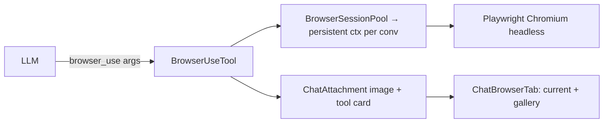

# SPEC-20261016-chat-browser-tool: `browser_use` tool + Browser tab (screenshots)

## 0. SPEC Metadata

| Field | Value |
|---|---|
| Feature name | `browser_use` agent tool (Playwright) + Browser tab showing shots |
| Product / System | agent-harness (Harness) |
| Module / Bounded Context | Integrations (tool) + Server + Blazor |
| Change type | Feature |
| Repository | afonsoft/agent-harness |
| Technical owner | afonsoft |
| Suggested branch | `feat/devin-20261016-chat-browser-tool` |
| Status | `Draft` |
| Depends on | SPEC-20261011-chat-workspace-panel (tab strip) |
| Reference | OpenHands `browser_use` + Browser tab; Devin Interactive Browser; COMPARISON §3 G-A6/G-L3 |

## 1. Executive Summary

### Problem

The agent has `fetch`/`web_search` (text only) — it cannot *see* or operate
the web UI it builds, so "teste a aplicação" loops depend on the user.
OpenHands ships `browser_use`; Devin has a live browser/computer view.

### Solution

1. **`browser_use` `IChatTool`** backed by headless Chromium (Playwright —
   browser already provisioned for E2E on this stack): actions
   `navigate | click | type | scroll | screenshot | extract_text |
   extract_html | eval_js(?)` operating on a per-conversation persistent
   browser context. Returns text + stores screenshots as run artifacts.
2. **Browser tab** (workspace panel): shows the latest screenshot per
   action with the URL bar history; thumbnails gallery during the run.
3. **Safety**: `browser_use` is `RequiresConfirmation` by default;
   `eval_js` is gated to `risk:high` (per SPEC-…-risk-approvals); viewport
   1280×800; navigation blocklist (file://, chrome://, non-http(s)).

### Scope

In scope: tool, session lifecycle, screenshot artifacts, tab gallery.
Out of scope: interactive click-through remote view (phase 2, noVNC/CDP
screencast), file downloads, multi-tab agent browsing, form autofill
wizards.

## 2. Requisitos

### Funcionais

- RF-001 `browser_use` args `{action, url?, selector?, text?, direction?,
  fullPage?, script?, waitMs?}`; a per-conversation `BrowserSession`
  (single page, persistent context dir under
  `<dataDir>/browser/<convId>`) — first call lazily launches Chromium.
- RF-002 Each action returns `{ok, url, title, text?}` and a stored
  screenshot path for `navigate|click|type|scroll|screenshot`
  (full-page flag respected).
- RF-003 Shots persist as attachments (`ChatAttachment` reuse — image/png)
  tagged `browser-shot`, so they render inline in the tool card AND feed
  the Browser tab; cap 25 shots per run (oldest dropped).
- RF-004 Browser tab (`ChatBrowserTab.razor`): current-page header
  (favicon+title+URL), latest shot fit-to-pane with click-to-zoom, gallery
  strip of the run's shots; auto-refreshes on `chat.sync` attachment
  events.
- RF-005 Session teardown: browser context closes when the run ends
  (idle GC also kills after 10min); server shutdown disposes the pool;
  profile dir reused across runs of the conversation (cookies persist like
  a real browser).
- RF-006 Blocklist: only `http(s)` schemes (localhost allowed); selector
  waits bounded (≤10s); per-call timeout 30s; page console errors captured
  into the observation text when `includeConsole:true`.
- RF-007 `RequiresConfirmation=true` on the tool (approval card shows the
  action summary + current shot thumbnail when one exists).

### Não-funcionais

- Playwright runs headless always; no X11 dependency at runtime
  (`--headless=new`); `PLAYWRIGHT_BROWSERS_PATH` honored.
- Screenshots are written via the existing attachment storage (never
  base64 in the SSE stream — URL references only).
- Memory: at most one live context per conversation, 3 live contexts
  global (LRU evict → context persisted, browser closed).

## 3. Arquitetura

- `IBrowserSessionPool` singleton (Server-hosted) owns contexts; the tool
  (Integrations) talks to it through the pool abstraction so tests fake it
  without a browser.
- `ChatAttachment` already carries download URLs — reuse for shots so the
  thread renders images exactly like generated images today.

## 4. Fases

- **P1** — tool core (navigate/click/type/scroll/screenshot/extract) +
  session pool + blocklist + timeouts.
- **P2** — shots as attachments + Browser tab + approval thumbnail +
  console capture.

## 5. Testes

- Unit: arg validation (scheme blocklist, selector bounds); session pool
  LRU/evict; shot cap; attachment tagging; `RequiresConfirmation` flag.
- Integration (real Chromium, marked `browser-e2e` category): serve a
  static page → navigate → extract_text → screenshot attachment exists and
  downloads; click+type update DOM → follow-up extract shows state.
- UI guards: tab placeholder, gallery render, zoom modal.
- Opt-in e2e wiring like `E2E_CHAT=1` convention (`E2E_BROWSER=1`).

## 6. Open questions

1. `eval_js` in v1? Proposed: yes but `risk:high` + `RequiresConfirmation`
   — it's the escape hatch that makes the tool genuinely useful (Devin
   parity), still approval-gated.
2. Separate browser per *run* vs per *conversation*? Proposed:
   conversation — user watches one continuous session (OpenHands model);
   runs share the same page state.
3. Record video of the session? Proposed: later — Playwright tracing +
   Gallery is enough for v1.
