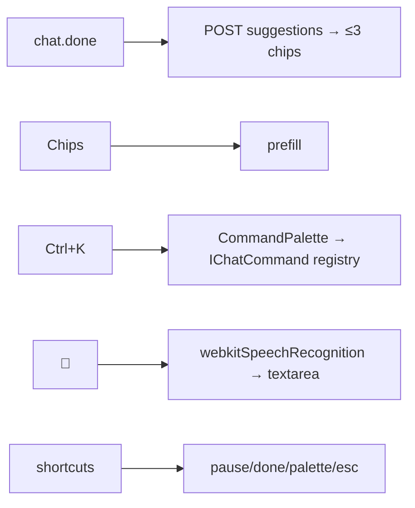

# SPEC-20261017-chat-polish: Suggestions, ⌘K palette, voice input, shortcuts

## 0. SPEC Metadata

| Field | Value |
|---|---|
| Feature name | Chat polish — next-action suggestions, ⌘K command palette, voice input, shortcuts |
| Product / System | agent-harness (Harness) |
| Module / Bounded Context | Blazor + Server (suggestions) |
| Change type | Feature |
| Repository | afonsoft/agent-harness |
| Technical owner | afonsoft |
| Suggested branch | `feat/devin-20261017-chat-polish` |
| Status | `Draft` |
| Depends on | SPEC-20261011-chat-workspace-panel (tab actions surface) |
| Reference | OpenHands `chat-suggestions`; Devin ⌘K palette + shortcuts + voice; user ask "abrir um talk" |

## 1. Executive Summary

### Problem

After a run ends the user types the next step from scratch; global actions
(new chat, stop, tabs, done) need hunting; no voice input. These are the
small accelerations that make Devin feel fast.

### Solution

1. **Suggestion chips**: when a run completes, generate ≤3 next-action
   suggestions (light provider call on the conversation's cheapest model,
   guided by the last assistant message + todo leftovers) — rendered as
   clickable chips above the composer; click prefills composer.
2. **⌘K palette**: global fuzzy palette — actions (new chat, archive,
   mark done, stop/pause run, toggle plan mode, open each workspace tab,
   jump to Terminal/Editor/Agents/Settings pages, toggle sidebar) +
   conversation jump. Reuses `SlashCommandPalette` filtering; commands
   self-register.
3. **Voice input**: mic button in composer — Web Speech API
   (`webkitSpeechRecognition`, pt-BR default locale from `harness.locale`,
   continuous interim transcript) fills the input; graceful hide when
   unsupported; no backend audio upload in v1.
4. **Shortcuts**: `Ctrl+.` pause/stop, `Ctrl+Shift+E` mark done
   (archive+complete), `Ctrl+K` palette, `Esc` closes panel/palette.

### Scope

In scope: the four items above. Out of scope: server-side transcription
(Whisper), push-to-talk wake word, suggestion ML ranking, custom shortcut
remapping UI.

## 2. Requisitos

### Funcionais

- RF-001 On `chat.done`: `POST /api/chat/conversations/{id}/suggestions`
  returns `{suggestions:[≤3 strings]}` — provider call with
  `max_tokens≈120`, prompt = last assistant msg + todo items + "3 próximas
  ações curtas"; failures → empty (never blocks); cached on the
  conversation until next run.
- RF-002 `SuggestionChips.razor` renders chips; click → text into composer
  (not auto-send); dismiss `×`.
- RF-003 `CommandPalette.razor`: `Ctrl+K`/`⌘K` opens; fuzzy match on
  `label`+`keywords`; `Enter` executes; items:
  - Conversations: jump top-5 by recency + search
  - Session: new chat, archive, mark done, stop run, pause/resume
  - Workspace: open Tasks/Changes/Terminal/Editor/Plan/Preview/Browser tab
  - App: Terminal, Editor, Agents, Settings, Jobs pages
  - Toggles: sidebar, plan mode, permission preset cycling
- RF-004 Actions dispatch through `IChatCommand` registry (name, icon,
  `canExecute(state)`, `execute`) — command bar stays data-driven, testable.
- RF-005 `VoiceInputButton`: `MediaRecorder`-free — `webkitSpeechRecognition`
  where available (lang from `LocaleService`: pt-BR/en-US/es-ES mapping);
  interim results stream into the textarea; click again stops; button
  hidden when API absent.
- RF-006 Shortcuts list in `?` help overlay (documented near palette);
  `Ctrl+.` = pause-or-stop, `Ctrl+Shift+E` = archive+mark-done prompt.
- RF-007 Suggestions never fire while run active or approvals pending;
  chips cleared on new run/conversation switch.

### Não-funcionais

- Suggestion call uses the conversation provider's configured fast model
  (orchestration probe order: `auto/fast` tier where defined) and is
  fire-and-forget — UI never waits.
- Palette: 100% keyboard operable (↑↓/Enter/Esc), `aria-activedescendant`.
- Voice: transcript goes into the input as text — the user still reviews
  before send (never auto-send).

## 3. Arquitetura

- `IChatCommand` registry in Blazor (Client-side commands call existing
  `TaskboardClient` endpoints + panel store).
- Suggestion generation is one `ChatService.CompleteAsync`-style call with
  a fixed prompt — no new pipeline.

## 4. Fases

- **P1** — ⌘K palette + command registry + shortcuts + help overlay.
- **P2** — suggestions endpoint + chips.
- **P3** — voice input button + locale mapping.

## 5. Testes

- Unit: command registry canExecute gates (no run → no pause cmd);
  palette fuzzy ordering; suggestion prompt shape; empty-on-failure.
- Integration: run completes → suggestions 200 ≤3; chips render per
  conversation.
- UI guards: Ctrl+K opens, Esc closes, aria attributes; voice button
  absent when API unsupported (JS stub).

## 6. Open questions

1. Suggestions in the conversation's reply language (pt-BR default)?
   Proposed: yes — same locale as `LocaleService`.
2. Show suggestions only after `completed`, also after `stopped`?
   Proposed: completed + stopped (user may continue), never after `failed`.
