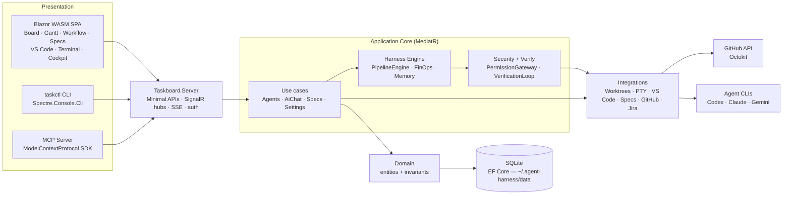
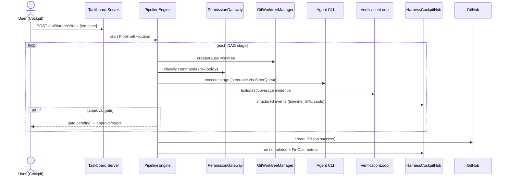
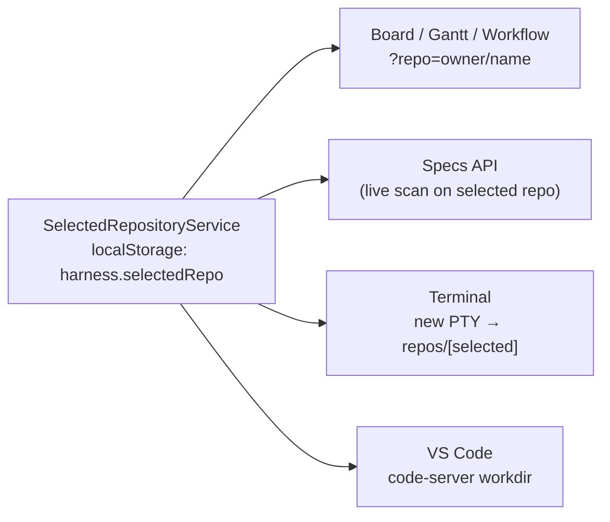

# System Architecture — agent-harness

This document describes the delivered architecture of **Harness**, the local-first AI agent workbench. The interactive diagram is generated from `architecture.json` → `architecture.html` (archify).

## 🏛️ Architectural Overview

`agent-harness` is a **Modular Monolith** built on **ABP N-Layer / Clean Architecture** (C# 14 / .NET 10). It is local-first: all state lives in `~/.agent-harness/data` (SQLite), and the only required outbound dependency is the GitHub API. On top of the taskboard core sits the **Harness (ADE) subsystem** — a multi-agent pipeline engine with HITL cockpit, security gateway, verification loop, project memory and FinOps metrics.

## 🧩 Component Map

### 1. Presentation Layer

- **Blazor WASM (`Taskboard.Blazor`)** — SPA served by the Server as static files. Pages: Board, Gantt, Workflow (read-only GitHub Actions monitor), Specs, VS Code, Terminal, Cockpit (`/cockpit` + `/cockpit/runs/{id}`), AI Chat, CLI Agents, FinOps, Settings, Skills, Prompts. The **global repository selector** (`SelectedRepositoryService`, persisted in `localStorage` as `harness.selectedRepo`) feeds every repo-scoped page and new terminal sessions / VS Code workdir.
- **`taskctl` (`Taskboard.Cli`)** — automation/CLI surface.
- **MCP Server (`Taskboard.Mcp`)** — exposes taskboard capabilities as tools to LLM clients.
- **`Taskboard.Maui`** — phase-2 shell (not part of the deployed server).

### 2. API Gateway (`Taskboard.Server`)

ASP.NET Core Minimal APIs + instance-token auth. Responsibilities:

- Route groups: `/api` (issues, `repos/{owner}/{repo}/*`, timeline, metrics, workflows), `/api/specs`, `/api/harness/{runs,pipelines,finops}`, `/api/agents`, `/api/agent-clis`, `/api/github`, `/api/vscode/*`, `/api/skills`, `/api/memory`, `/api/configuration`, `/api/mcp/*`, `/api/local/*` (incl. `local/cli-metrics`), `/api/settings`.
- **SignalR hubs:** `HarnessCockpitHub` (`/harness-cockpit-hub`), `TerminalHub` (`/terminal-hub`, PTY sessions), `AgentLogHub` (`/agent-log-hub`).
- **SSE:** `/api/events` for board/issue updates.
- **Hosted services:** `SpecDriftScanService` (maintenance job; drift report cached, `?repo=` forces live scan), `StaleAgentRunReaperService`, FinOps aggregation, CLI metrics sync, in-memory event streams (cockpit + AI-chat threads).
- Manages external process lifecycles: **code-server** (VS Code, incl. `POST /api/vscode/restart`) and **PTY shells** bound to the selected repo's workspace.

### 3. Application Layer (`Taskboard.Application`)

MediatR commands/queries + module app services: `Agents`, `AiChat`, `CliMetrics`, `Configuration`, `GitHub`, `Settings`, `Specs`, `Mapping`, and **`Harness`**:

- **`PipelineEngine`** — executes multi-stage DAG runs (`PipelineExecution`): dispatches stages in dependency order, honors approval gates, accepts **steer** messages mid-flight (`SteerQueue`), cancels via token, emits structured timeline events, and can create a PR on success.
- **`PipelineExecutionAppService`**, **`PipelineTemplates`**, **`PipelineContextSynthesizer`** — run lifecycle, template catalog, and per-stage context assembly.
- **`FinOpsService` / `FinOpsAggregator`** — per-run and aggregate token/cost metrics.

### 4. Domain Layer (`Taskboard.Domain` + `Domain.Shared`)

Source of truth: GitHub issues/labels (no local `Project`/`Task` aggregates). Local entities: `AiChatThread`, `AgentRun`, `AgentLog`, `IssueHistoryEvent`, `ConfigurationOverride`, `UserPreference`, `AgentPreference`, plus **Harness entities**: `WorktreeSession`, `ProjectMemoryItem`, `VerificationReport`. Value objects/ids and enums live in `Domain.Shared` (`SecurityPolicyMode`, `SecurityRiskLevel`, `VerificationStatus`, `WorktreeStatus`, `MemoryType`). Optimistic concurrency via `long Version` (`VERSION_CONFLICT` → 409).

### 5. Persistence (`Taskboard.EntityFrameworkCore`)

EF Core 10 + SQLite. Repositories + `EfCoreMemoryService`, `EfCoreWorktreeSessionRepository`, `EfCoreVerificationReportRepository`; migrations per entity family.

### 6. Integrations (`Taskboard.Integrations`)

- **`Harness/`** — `GitWorktreeManager` (run isolation), `SteerQueue`, `ContextCompactor`, `ProjectContextCompiler`, `DotNetVerificationEngine` + `VerificationLoop` (build/test/coverage evidence, `TestFailureParser`, `CompilerErrorParser`, `CoverageCalculator`).
- **`Harness/Security/`** — `PermissionGateway` + `DynamicCommandClassifier` + `PathJailValidator` + `SecretScrubber` (policy modes, risk levels, jailed writes, output scrubbing).
- **`Agents/`** — CLI discovery/execution/cancel + logs for Codex/Claude/Gemini-class CLIs; **`Execution/`** — `ProcessCommandRunner`, `ProcessTreeSignaler`.
- **`Terminal/`** — PTY session host (TIOCSWINSZ resize, orphan reattach, sweeper).
- **`Vscode/`** — code-server process lifecycle (spawn/restart/workdir).
- **`Specs/`** — `MarkdigSpecParser`, `SpecDriftDetector` (living specs ↔ code drift).
- **`GitHub/`** (Octokit), **`Jira/`**, **`Cloud/`** (optional D1/R2 companion), **`CliDb/`**, **`Mcp/`**, **`Skills/`**, **`Workspace/`**.

## 🔄 Primary Flows

### Pipeline run (ADE)

### Repository selector → repo-scoped surfaces

### Realtime event path

`PipelineEngine / Terminal / Agent runs` → in-memory event streams + `IAgentLogBroadcaster` → SignalR hubs (`/harness-cockpit-hub`, `/terminal-hub`, agent logs) + SSE `/api/events` → Blazor clients (late joiners get replayed event history).

## 🔒 Trust Boundary

Local-first: the server binds localhost and every request requires the instance token. All durable state stays in `~/.agent-harness/data`. Outbound calls are limited to GitHub (required), optional Jira/Cloud companion, and the agent CLIs spawned locally inside jailed worktrees. Commands executed on behalf of agents pass through `PermissionGateway` risk classification, `PathJailValidator` write restrictions and `SecretScrubber` on outputs.

## 🚢 Deployment Topology

systemd **user** service `harness-server.service` → `~/.agent-harness/bin/harness-server` → `Taskboard.Server.dll` (published to `~/.agent-harness/publish`), env in `~/.agent-harness/env`, workspace root `~/repos`, listening on `http://127.0.0.1:47823`. code-server and PTY shells are child processes of the service.

---
*Generated from `docs/architecture/architecture.json` — interactive version: `architecture.html`*
